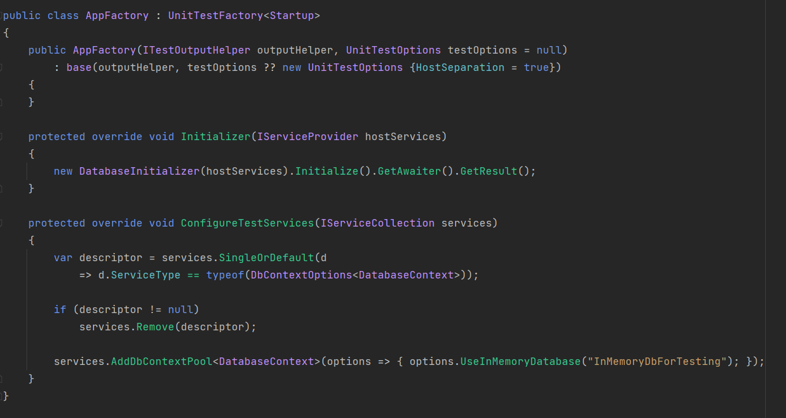
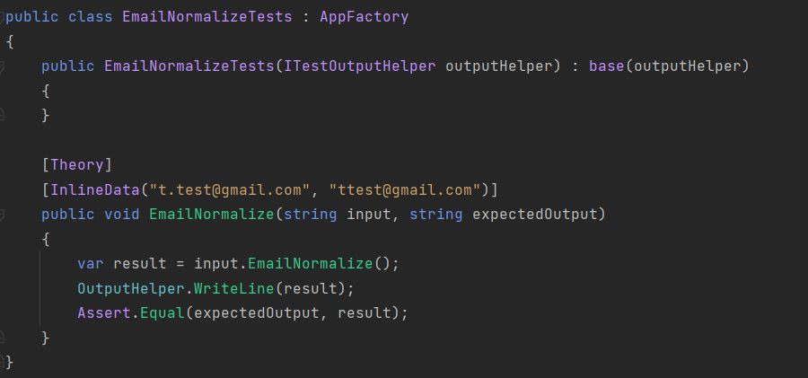
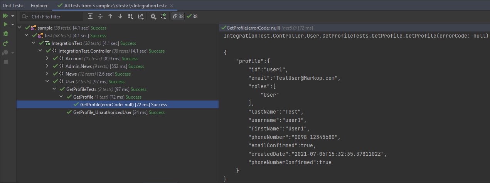
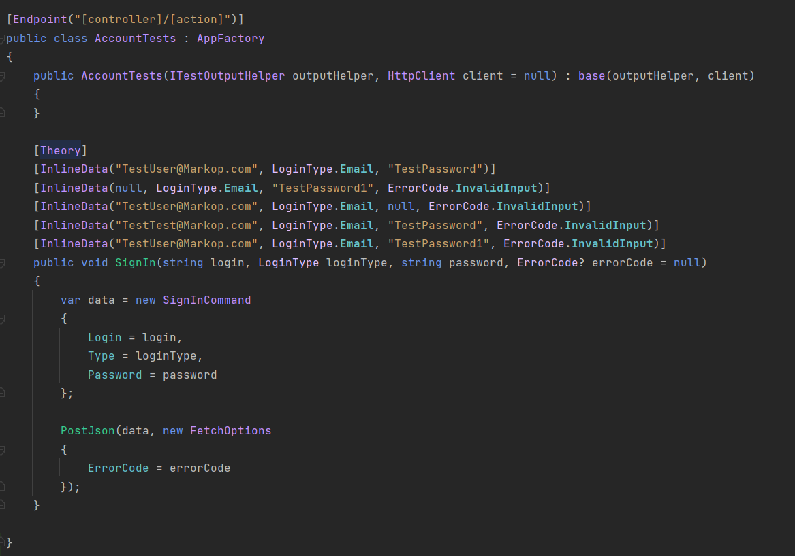

<h1 align="center">Markop Test</h1>
<h6 align="center">

</h6>

Markop Test is a free, open-source, focused testing tool for **.Net**. Using Markop Tests you can easily write **Unit tests**, **Integration tests**, **Functional tests** and **Load** tests.

## Getting Started

In order to use Markop test you should do the following steps:

1- Create a class library project inside your solution and name it according to the kind of test you want to perform, e.g., "FunctionalTest". Don't forget to add the project to your solution. 

    <pre class="notranslate"><code>dotnet new classlib -n [YOUR PROJECT NAME]</code></pre>

    <pre class="notranslate"><code>dotnet sln add [YOUR PROJECT NAME]</code></pre>

2- Inside the newly created project add a reference to the project you want to test 

3- Install the Markop Test package inside your test project: 
 
Nuget:

    <pre class="notranslate"><code>Install-Package MarkopTest</code></pre>

 Or using dotnet CLI:

    <pre class="notranslate"><code>dotnet add package MarkopTest</code></pre>

4- Depending on the kind of testing you want to perform you should go to: [Unit test](#unit-test)
, [Integration test](#integration-test),
[Functional test](#functional-test) or [Load test](#load-test).

## Unit Test

 Unit Tests are supposed to test the behaviour of a smallest piece of code. Markop Test is here to make this process fully automated. Writing Unit Tests has never been easier before!!

### Usage

First of all you should create an <code>AppFactory</code> class extend it from <code>UnitTestFactory</code> class.

Then you need to override <code>Initializer</code> and <code>ConfigureTestServices</code> methods

<code>Initializer</code> method gives you the ability to initiate a custom database for testing all you have to do is to build your custom initializer and called it here. Markop Test will take care of the rest!!

<code>ConfigureTestServices</code> method gives you the ability to register/remove the services. This way you will have full control over the registered services of your app before you start testing!! 

A sample implementation looks like this:
 

Then you need to create a class and extend it from your own <code>AppFactory</code> class 

Next, you should define a method inside your class and put your pereferable test attribute. It can be <code>[Fact]</code> or <code>[Theory]</code> or any other valid test attribute in Xunit.

Now you can start writing your test code inside your method!!

For example in the below code we wrote code to test an extention method called <code>EmailNormalize</code>

 

## Integration Test

A part of software testing that tests individual code components to validate interactions among different software
system modules. \
We use these tests are used to test the app's infrastructure and the whole framework, often including the following
components:

- Database
- File system
- Request-response pipeline

Markop provides an app factory abstraction to make it easy to implement a **clean** integration test and view output
instead of using external API testing tools such as Postman.

    

### Usage

First of all you should create an <code>AppFactory</code> class extend it from <code>IntegrationTestFactory</code> class.

Next you need to override [Initializer](#1--codeinitializeriserviceprovider-hostservicescode), [ConfigureTestServices](#2--codeconfiguretestservicesiservicecollection-servicescode), [GetUrl](#3--codegeturlstring-url-string-controllername-string-testmethodnamecode), [ValidateResponse](#4--codevalidateresponsehttpresponsemessage-httpresponsemessagetfetchoptions-fetchoptionscode) methods.

Then you need to create a class and extend it from your own <code>AppFactory</code> class. For a cleaner implementation we suggest creating a class for each controller in your API.

Use <code>Endpoint</code> atrribute to specify a pattern for request addresses.

Next, you should define a method inside your class and put your pereferable test attribute. It can be <code>[Fact]</code> or <code>[Theory]</code> or any other valid test attribute in Xunit.

Now you can start writing your test code inside your method!!

For example in the below code we wrote code to test a <code>SignIn</code> API 

**Attention1**: At runtime variables like <code>controller</code> and <code>action</code> inside <code>Endpoint</code> atrribute will be intitalized with **_name of your class_** and **_name of your method_**.

**Attention2**: Markop Test automatically ignors the ["Test", "Tests", "Controller"] at end of your class name.

For example in the above code the <code>controller</code> value will be "Account" and the <code>action</code> value will be "SignIn". The requests will be sent to <code>/Account/SignIn</code> endpoint.

## Functional Test

The test determines the product's functionality that can be done by aggregating integration tests and comparing the
actual output with the predetermined output. \
We use case scenarios for functional testing. For example, in a news system, we must test managing news scenarios such
as **Create**, **Edit** and **Delete** news entity, you can implement transaction workflow in your system. \
As in the integration testing, Markop provides an app factory abstraction to make it easy to implement a **clean**
functional test.

#### Usage

- TODO

## Load Test

### Usage
- Todo

## Present Methods
### 1- <code>Initializer(IServiceProvider hostServices)</code>:
<code>Initializer</code> method gives you the ability to initiate a custom database for testing. All you have to do is to build your custom initializer and called it here. Markop Test will take care of the rest!!

### 2- <code>ConfigureTestServices(IServiceCollection services)</code>

<code>ConfigureTestServices</code> method gives you the ability to register/remove the services. This way you will have full control over the registered services of your app before you start testing!! 

A sample implementation looks like this:
 

### 3- <code>GetUrl(string url, string controllerName, string testMethodName)</code>
<code>GetUrl</code> helps you to build the correct address to which HttpClient is going to send the request.

### 4- <code>ValidateResponse(HttpResponseMessage httpResponseMessage,TFetchOptions fetchOptions)</code>
<code>ValidateResponse</code> enables you to customise the response validation proccess according to expected behaviour of your API. 

## Contributions

If you're interested in contributing to this project, first of all, We would like to extend my heartfelt gratitude. \
Please feel free to reach out to us if you need help.

## LICENSE

MIT